### Drew Porter

Backend engineer at [Halter](https://halterhq.com). I build the systems behind virtual fencing: collar telemetry, fleet tooling, and the data work that keeps cattle where they should be.

Mostly Go and TypeScript. A lot of Athena.

📫 **porter.d003@gmail.com**
🔗 [LinkedIn](https://linkedin.com/in/drewporter)
